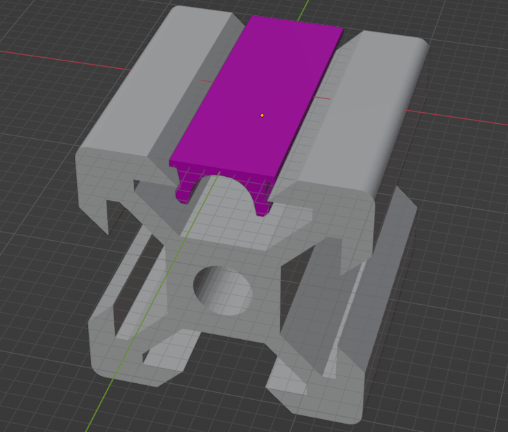
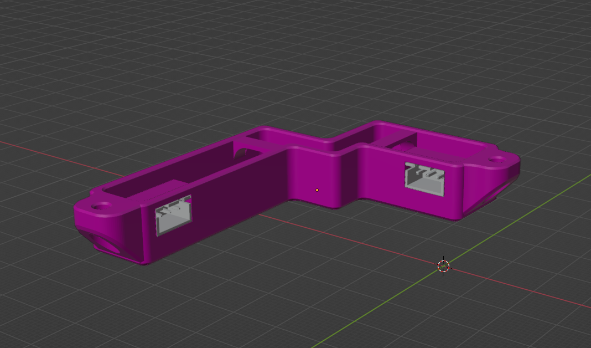
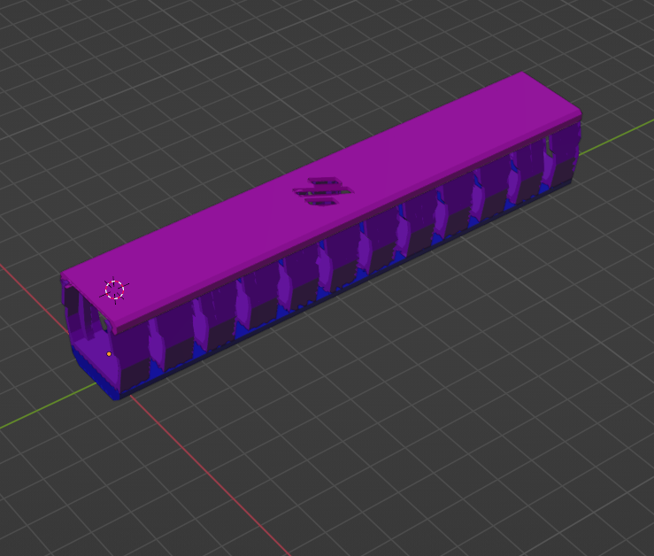
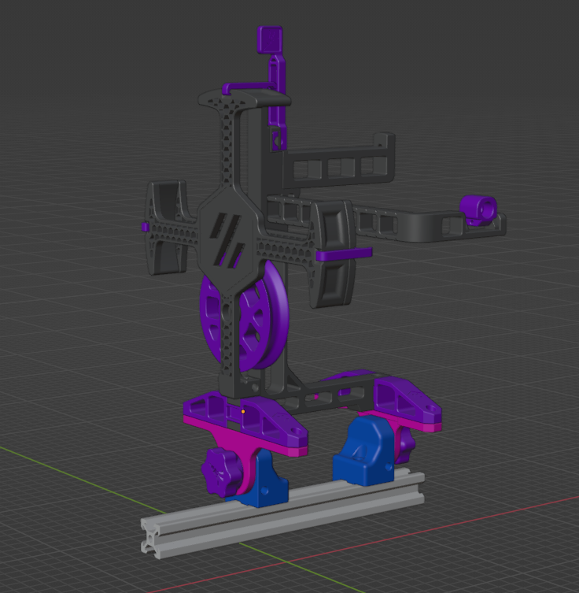
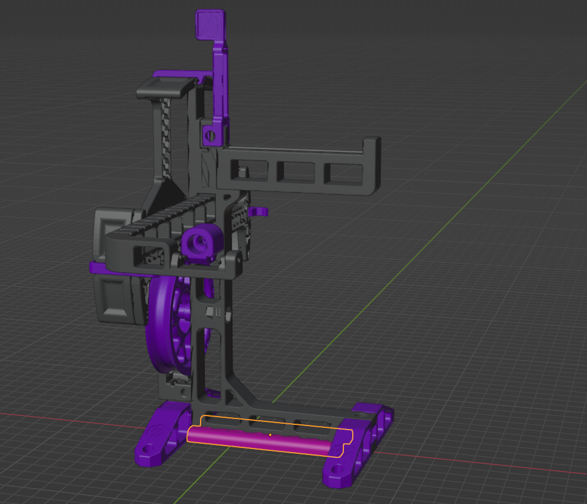
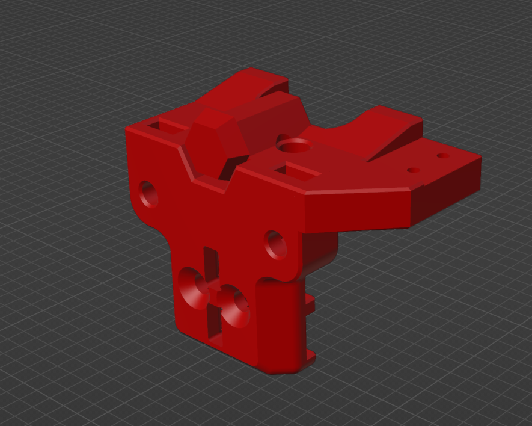
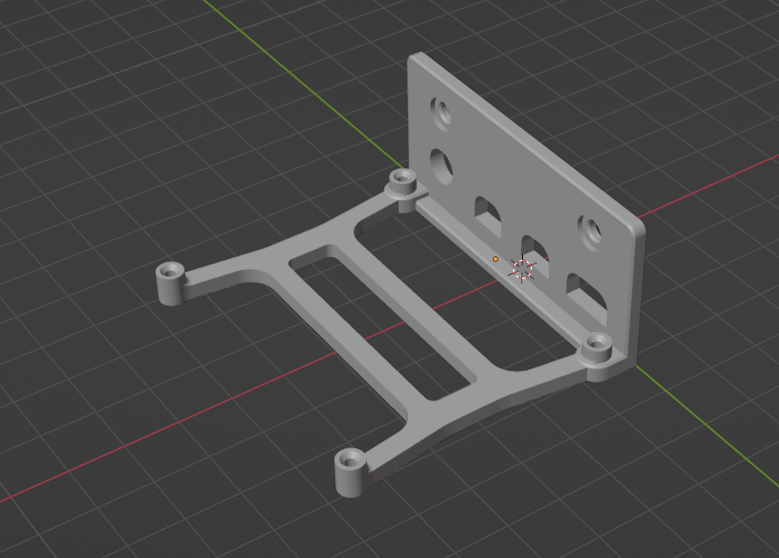
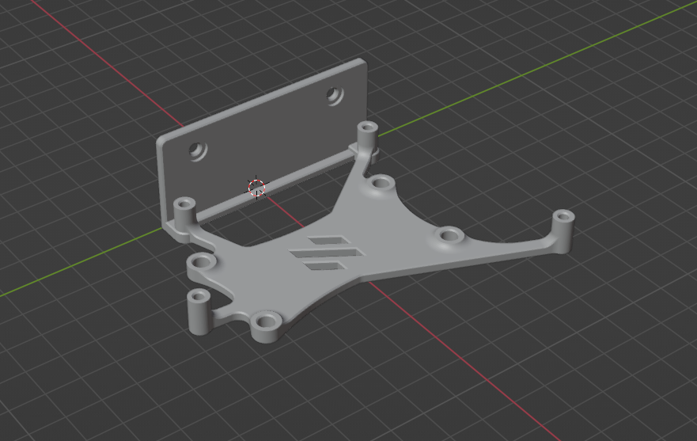

<h1 align="center">GP3DS's repository for Voron printer's mods</h1>

 
This is a work in progress, all files can be updated / deleted at any time

<table align="center">
  <tr>
    <td align="center">Mod name</td>
    <td align="center">Printer compatibility</td>   
  </tr>
  <tr>
    <td align="center">
      <a href="./2020_Slot_Cover">2020 Slot Cover </a></td>
    <td align="center">All Printer with 2020 Slots</td>   
  </tr>  
  <tr>
    <td align="center">
      <a href="./Corner_cable_Hiders">Corner cable hider </a></td>
    <td align="center">Voron 2.4</td>   
  </tr>
  <tr>
    <td align="center">
      <a href="./Cable_Duct">Cable Duct (140-200-305mm) </a></td>
    <td align="center">Voron 2.4</td>   
  </tr>
  <tr>
    <td align="center">
      <a href="./ERCP_frame_mount">ERCP Frame mount </a></td>
    <td align="center">All Printer with 2020 Slots</td>   
  </tr>
  <tr>
    <td align="center">
      <a href="./ERCP_stand_lock">ERCP stand lock </a></td>
    <td align="center">Any printer who use ERCF</td>   
  </tr>
  <tr>
    <td align="center">
      <a href="./V0_X_Carriage_with_endstop">X Carriage with X endstop </a></td>
    <td align="center">Voron V0.1 and V0.2 with MCU can't accept sensorless homing</td>   
  </tr>
  <tr>
    <td align="center">
      <a href="./V0_Pi4_bracket">Raspberri Pi 4 Bracket frame mount for V0 </a></td>
    <td align="center">Voron V0.1 and V0.2 and any printer with 2020 or 1515 Slots</td>   
  </tr>
  <tr>
    <td align="center">
      <a href="./V0_Cheetah_V2_bracket">Fysetc Cheetah V2.0 bracket frame mount for V0 </a></td>
    <td align="center">Voron V0.1 and V0.2 and any printer with 2020 or 1515 Slots</td>   
  </tr>
</table>
